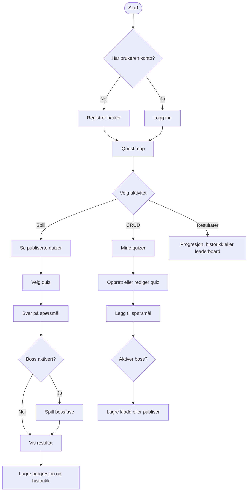
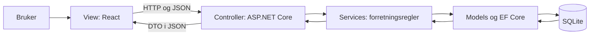
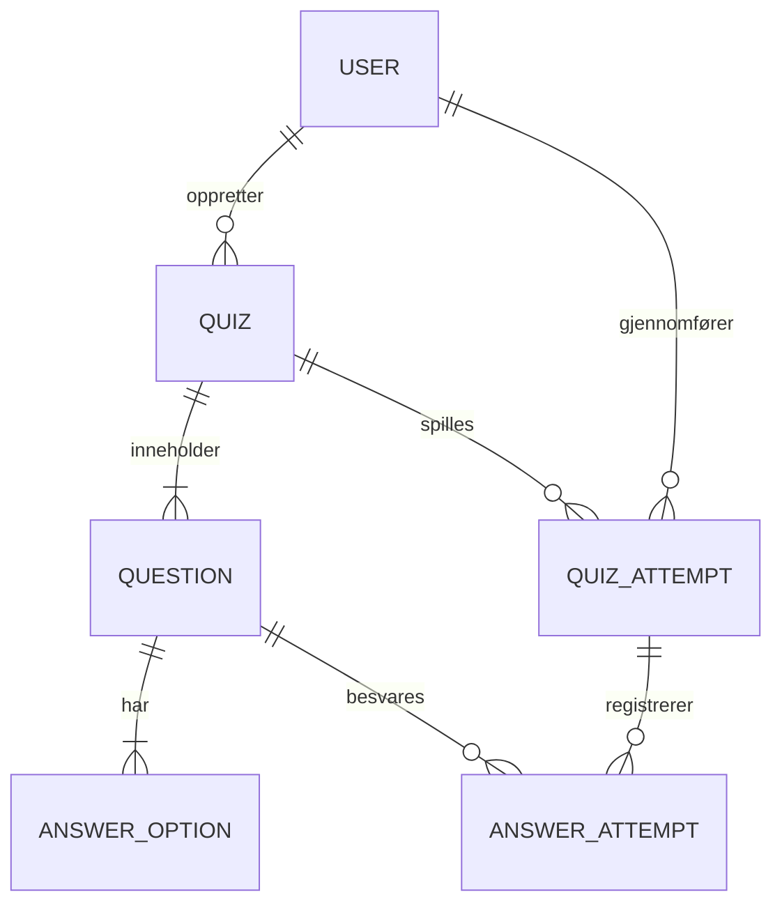

# Become a Wizzard

En lokal gamification-plattform for kurslæring. Brukeren kan lage og publisere flervalgsquizer, spille quizer, få umiddelbar tilbakemelding og følge egen progresjon. En quiz kan valgfritt avsluttes med en bosskamp.

Prosjektet bruker én rolle: **Bruker**. Den samme brukeren kan både opprette innhold og spille innhold. Vi skiller derfor ikke mellom elev og lærer.

## Teknologi

| Del | Teknologi |
|---|---|
| Frontend | React med JavaScript og JSX |
| Byggverktøy | Vite |
| Komponentbibliotek | React Bootstrap og Bootstrap CSS |
| Backend | ASP.NET Core Web API, .NET 8 |
| Database | SQLite |
| ORM | Entity Framework Core |
| Autentisering | Lokal cookie-autentisering |
| API-dokumentasjon | Swagger |

Applikasjonen krever ingen nettbasert database eller ekstern autentisering. Data lagres i `server/BecomeAWizzard.Api/Data/become-a-wizzard.db` på maskinen som kjører API-et.

## Funksjoner

- Registrere bruker og logge inn
- Se publiserte quizer
- Opprette, lese, redigere og slette egne quizer
- Legge til spørsmål, svaralternativer, fasit og forklaringer
- Lagre quiz som kladd eller publisere den
- Velge om en quiz skal ha bosskamp
- Svare på flervalgsspørsmål og få umiddelbar feedback
- Motta poeng ved riktig svar og miste HP ved feil svar
- Se progresjon og tidligere quizforsøk
- Se et lokalt leaderboard basert på XP

### Valgfri bosskamp

Bosskamp aktiveres per quiz i quizbyggeren. Når funksjonen er deaktivert, avsluttes quizen etter siste ordinære spørsmål. Når den er aktivert, går brukeren videre til en bossfase.

I bossfasen:

- Tre riktige svar på rad skader bossen.
- Et feil svar reduserer spillerens HP.
- Et feil svar nullstiller rekken med riktige svar.
- Brukeren vinner når bossens HP når null.
- Brukeren taper når spillerens HP når null.

## Brukerflyt



## MVC-arkitektur

React og ASP.NET Core brukes sammen som en klientbasert variant av MVC.



### Model

Model beskriver dataene og relasjonene i domenet:

- `User` representerer én generell bruker.
- `Quiz` inneholder innstillinger for HP, publisering og valgfri bosskamp.
- `Question` tilhører en quiz.
- `AnswerOption` tilhører et spørsmål og markerer fasiten.
- `QuizAttempt` lagrer aktiv og avsluttet kampstatus.
- `AnswerAttempt` lagrer hvert svar og poengendringen.

`AppDbContext` kobler modellene til SQLite gjennom Entity Framework Core.

### View

React-komponentene under `client/src` utgjør View. De viser quizdata, skjemaer, kampstatus og progresjon. View sender brukerens valg til controllerne og presenterer svaret fra backend.

View avgjør aldri selv om et svar er riktig. Den beregner heller ikke offisiell HP, score eller bosskade. Disse verdiene kommer fra `GameService`.

### Controller

Controllerne under `server/BecomeAWizzard.Api/Controllers` eksponerer REST-endepunkter. De mottar HTTP-forespørsler, henter innlogget bruker-ID og kaller riktig service.

Controllerne inneholder lite forretningslogikk:

- `AuthController` bruker `AuthService`.
- `QuizzesController` bruker `QuizService`.
- `GameController` bruker `GameService`.
- `ProgressController` leser oppsummeringer gjennom `AppDbContext`.

### Service-laget

Service-laget er et tillegg til de tre klassiske MVC-delene. Det holder controllerne små og gjør domenereglene enklere å teste.

- `AuthService` registrerer og validerer brukere.
- `QuizService` validerer og utfører quiz-CRUD.
- `GameService` kontrollerer svar og beregner HP, poeng, streak, bossfase og kampresultat.

## Hvordan filene samarbeider

### Innlogging

```text
AuthPage.jsx
  -> authApi.js
    -> apiClient.js
      -> AuthController.cs
        -> AuthService.cs
          -> AppDbContext.cs
            -> User.cs / SQLite
```

`AuthContext.jsx` lagrer den aktive brukeren i frontend og gjør brukeren tilgjengelig for `AppShell.jsx` og alle sidene.

### Quiz-CRUD

```text
MyQuizzesPage.jsx / QuizEditorPage.jsx
  -> quizApi.js
    -> QuizzesController.cs
      -> QuizService.cs
        -> AppDbContext.cs
          -> Quiz.cs, Question.cs og AnswerOption.cs
            -> SQLite
```

`QuizEditorPage.jsx` sender et objekt som må samsvare med `QuizInput` i `QuizDtos.cs`. Hvis feltnavn endres i DTO-en, må frontend-objektet oppdateres samtidig.

### Gjennomføring av quiz

```text
PlayPage.jsx
  -> gameApi.js
    -> GameController.cs
      -> GameService.cs
        -> QuizAttempt.cs og AnswerAttempt.cs
          -> AppDbContext.cs
            -> SQLite
```

`PlayPage.jsx` viser bare kampstatusen som returneres fra `GameService.cs`. Fasit sendes først etter at brukeren har levert et svar.

### Progresjon

```text
ProgressPage.jsx / HistoryPage.jsx / LeaderboardPage.jsx
  -> progressApi.js
    -> ProgressController.cs
      -> AppDbContext.cs
        -> User.cs, QuizAttempt.cs og AnswerAttempt.cs
```

## Mappestruktur

```text
become-a-wizzard/
├── BecomeAWizzard.sln
├── README.md
├── .github/workflows/ci.yml
├── client/
│   ├── index.html
│   ├── package.json
│   ├── vite.config.js
│   └── src/
│       ├── api/
│       ├── components/
│       ├── context/
│       ├── pages/
│       ├── styles/
│       ├── App.jsx
│       └── main.jsx
└── server/
    └── BecomeAWizzard.Api/
        ├── Controllers/
        ├── Data/
        ├── DTOs/
        ├── Extensions/
        ├── Models/
        ├── Properties/
        ├── Services/
        ├── Program.cs
        ├── appsettings.json
        └── BecomeAWizzard.Api.csproj
```

## Frontend-mapper og filer

### `client/`

| Fil | Ansvar |
|---|---|
| `index.html` | HTML-inngangspunktet der React monteres i elementet `root`. |
| `package.json` | Definerer React, Vite, React Bootstrap og kommandoene for utvikling og bygg. |
| `vite.config.js` | Aktiverer React-plugin og sender `/api` videre til ASP.NET Core på port 5080. |

### `client/src/`

| Fil eller mappe | Ansvar |
|---|---|
| `main.jsx` | Laster Bootstrap, global CSS og starter React-applikasjonen. |
| `App.jsx` | Velger aktiv side og kobler sidene til det felles navigasjonsskallet. |
| `api/` | Samler alle HTTP-kall mot backend. |
| `components/` | Inneholder gjenbrukbare UI-komponenter. |
| `context/` | Holder global innloggingsstatus. |
| `pages/` | Inneholder komplette skjermbilder. |
| `styles/app.css` | Definerer fantasy-temaet og responsive regler. |

### `client/src/api/`

| Fil | Ansvar og avhengigheter |
|---|---|
| `apiClient.js` | Felles `fetch`-funksjon. Sender autentiseringscookie og håndterer API-feil. |
| `authApi.js` | Avhenger av `apiClient.js`. Speiler rutene i `AuthController`. |
| `quizApi.js` | Avhenger av `apiClient.js`. Speiler rutene i `QuizzesController`. |
| `gameApi.js` | Avhenger av `apiClient.js`. Speiler rutene i `GameController`. |
| `progressApi.js` | Avhenger av `apiClient.js`. Speiler rutene i `ProgressController`. |

### `client/src/components/`

| Fil | Ansvar |
|---|---|
| `AppShell.jsx` | Sidepanel, navigasjon og aktiv bruker. Avhenger av `AuthContext.jsx`. |
| `PageHeader.jsx` | Felles overskrift for sidene. |
| `QuizCard.jsx` | Gjenbrukbart kort for publiserte og egne quizer. |

### `client/src/pages/`

| Fil | Ansvar |
|---|---|
| `AuthPage.jsx` | Registrering og innlogging. |
| `DashboardPage.jsx` | Quest map og innganger til quizliste og quizbygger. |
| `QuizListPage.jsx` | Søker i og viser publiserte quizer. |
| `MyQuizzesPage.jsx` | Leser og sletter brukerens egne quizer. |
| `QuizEditorPage.jsx` | Oppretter og oppdaterer quiz, spørsmål og valgfri bosskonfigurasjon. |
| `PlayPage.jsx` | Starter quizforsøk, sender svar og viser kampstatus. |
| `ProgressPage.jsx` | Viser XP, fullførte quizer og nøyaktighet. |
| `HistoryPage.jsx` | Viser tidligere quizforsøk. |
| `LeaderboardPage.jsx` | Viser lokal XP-rangering. |

## Backend-mapper og filer

### `Controllers/`

| Fil | Ansvar |
|---|---|
| `AuthController.cs` | Registrering, innlogging, utlogging og aktiv bruker. |
| `QuizzesController.cs` | CRUD-endepunkter for quiz. |
| `GameController.cs` | Starter forsøk, returnerer kampstatus og mottar svar. |
| `ProgressController.cs` | Returnerer progresjon, historikk og leaderboard. |

### `Models/`

| Fil | Ansvar |
|---|---|
| `User.cs` | Brukerdata, XP, quizer og forsøk. |
| `Quiz.cs` | Quizinnstillinger, publisering og bossvalg. |
| `Question.cs` | Spørsmålstekst, forklaring og rekkefølge. |
| `AnswerOption.cs` | Svartekst og fasitmarkering. |
| `QuizAttempt.cs` | Aktiv kampstatus og samlet resultat. |
| `AnswerAttempt.cs` | Ett levert svar med poengendring. |

### `DTOs/`

DTO-er bestemmer hvilke data som kan sendes inn og ut av API-et. De hindrer at databasemodellene og fasiten eksponeres direkte.

| Fil | Ansvar |
|---|---|
| `AuthDtos.cs` | Request- og response-objekter for autentisering. |
| `QuizDtos.cs` | Objekter for quiz-CRUD og visning. |
| `GameDtos.cs` | Objekter for kampstart, spørsmål, svarresultat og progresjon. |

### `Services/`

| Fil | Ansvar |
|---|---|
| `AuthService.cs` | Passordhashing og validering av innlogging. |
| `QuizService.cs` | Eierkontroll, validering og CRUD for hele quizgrafen. |
| `GameService.cs` | Spillets domene- og bossregler. |

### `Data/`

| Fil | Ansvar |
|---|---|
| `AppDbContext.cs` | EF Core-konfigurasjon og tabelltilgang. |
| `SeedData.cs` | Oppretter demobruker og en quiz første gang databasen opprettes. |
| `become-a-wizzard.db` | Opprettes lokalt ved første oppstart og versjoneres ikke i Git. |

### Andre backend-filer

| Fil | Ansvar |
|---|---|
| `Program.cs` | Registrerer database, services, autentisering, CORS, Swagger og API-ruter. Serverer også ferdigbygget React lokalt når `client/dist` finnes. |
| `appsettings.json` | Inneholder SQLite-connection string og logging. |
| `Properties/launchSettings.json` | Setter API-adressen til `http://localhost:5080`. |
| `BecomeAWizzard.Api.csproj` | Definerer .NET 8 og NuGet-avhengigheter. |

### Automatisk byggkontroll

`.github/workflows/ci.yml` bygger både ASP.NET Core og React ved push eller pull request mot `main`. Workflowen avhenger av `BecomeAWizzard.sln`, backendens `.csproj`, `client/package.json` og `client/package-lock.json`.

## Databaseforhold



## API-endepunkter

| Metode | Rute | Formål |
|---|---|---|
| `POST` | `/api/auth/register` | Registrer bruker |
| `POST` | `/api/auth/login` | Logg inn |
| `GET` | `/api/auth/me` | Hent aktiv bruker |
| `POST` | `/api/auth/logout` | Logg ut |
| `GET` | `/api/quizzes` | Hent publiserte quizer |
| `GET` | `/api/quizzes/mine` | Hent egne quizer |
| `GET` | `/api/quizzes/{id}` | Hent egen quiz med fasit for redigering |
| `POST` | `/api/quizzes` | Opprett quiz |
| `PUT` | `/api/quizzes/{id}` | Oppdater quiz |
| `DELETE` | `/api/quizzes/{id}` | Slett eller arkiver quiz |
| `POST` | `/api/game/attempts` | Start quizforsøk |
| `GET` | `/api/game/attempts/{id}` | Hent aktiv kampstatus |
| `POST` | `/api/game/attempts/{id}/answers` | Lever svar |
| `GET` | `/api/progress` | Hent progresjon |
| `GET` | `/api/progress/history` | Hent historikk |
| `GET` | `/api/progress/leaderboard` | Hent lokal rangering |

## Kjør prosjektet lokalt

### Forutsetninger

- .NET 8 SDK
- Node.js 20 eller nyere
- npm

### 1. Installer frontend-avhengigheter

```bash
cd client
npm install
```

### 2. Start ASP.NET Core API

Åpne en terminal fra prosjektroten:

```bash
dotnet restore
dotnet run --project server/BecomeAWizzard.Api
```

API-et starter på `http://localhost:5080`. Swagger finnes på `http://localhost:5080/swagger` i Development-miljøet.

### 3. Start React med Vite

Åpne en ny terminal:

```bash
cd client
npm run dev
```

Åpne `http://localhost:5173`.

### Demobruker

```text
E-post: demo@wizard.local
Passord: Wizard123!
```

### Kjør som én lokal ASP.NET Core-prosess

Bygg først React:

```bash
cd client
npm run build
cd ..
dotnet run --project server/BecomeAWizzard.Api
```

Når `client/dist` finnes, serverer ASP.NET Core den ferdigbygde frontenden lokalt fra `http://localhost:5080`.

## Kommentarprinsipp for avhengigheter

Kodefiler inneholder kommentarer ved koblinger som ellers kan være vanskelige å oppdage. Eksempel:

```js
// QuizEditorPage depends on QuizInput in the backend.
// Keep field names aligned with QuizDtos.cs.
```

Kommentaren betyr at en endring i `QuizInput` kan kreve en tilsvarende endring i `QuizEditorPage.jsx`.

Vi kommenterer filavhengigheter og viktige designvalg. Vi kommenterer ikke hver enkel kodelinje, siden slike kommentarer raskt blir utdaterte og gjør koden vanskeligere å lese.

## Sikkerhet og lokal bruk

- Passord lagres som hash, ikke klartekst.
- Autentiseringscookie er `HttpOnly`.
- Fasit sendes ikke til frontend før brukeren har svart.
- En bruker kan bare redigere og slette egne quizer.
- Backend validerer alle quizregler selv om frontend også validerer skjemaet.
- SQLite-filen ligger lokalt og er ekskludert fra Git.

## Videre arbeid

- Legge til automatiserte .NET-tester når testprosjektet etableres
- Støtte bilde og kodeoppgaver i tillegg til flervalg
- Legge til achievements og streaks
- Lage quizimport og eksport som JSON
- Bytte `EnsureCreated` med EF Core migrations dersom databasen skal utvikles over flere versjoner
